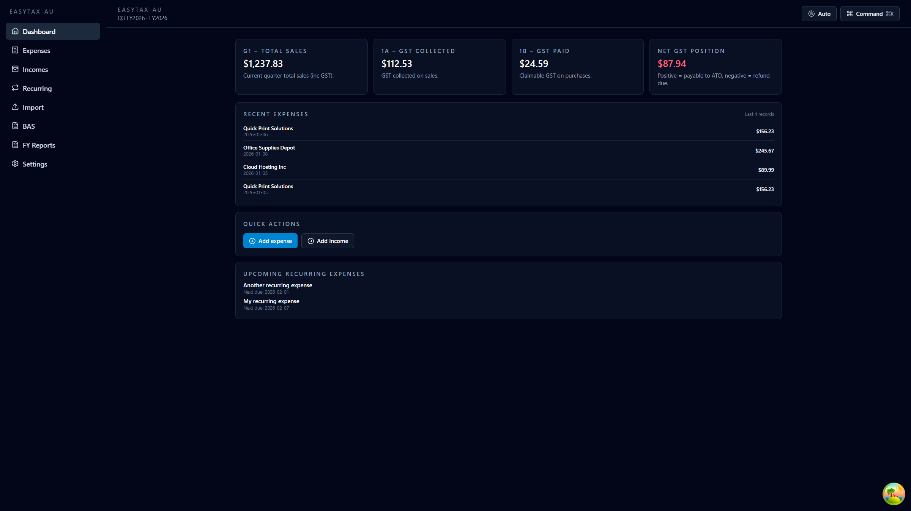
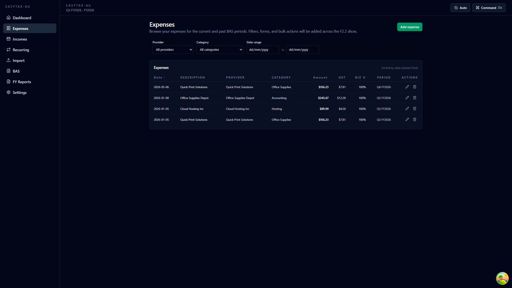
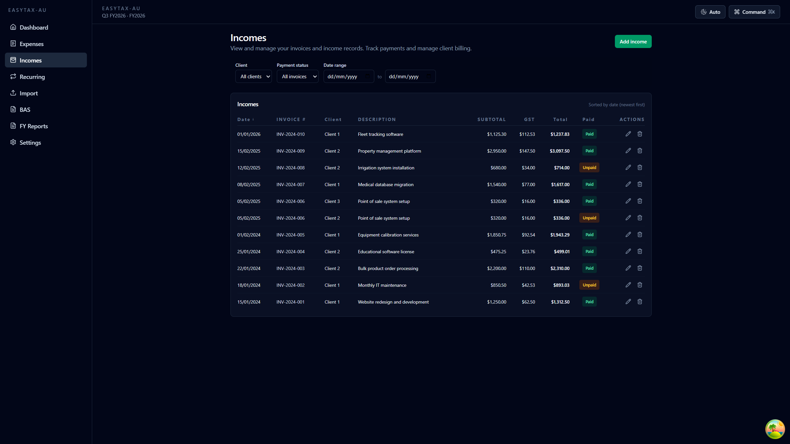
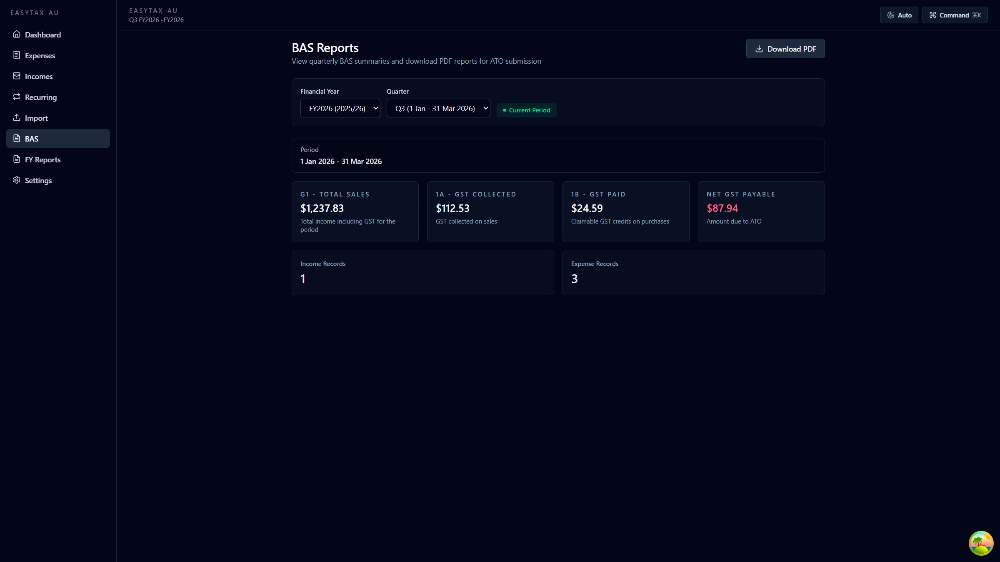
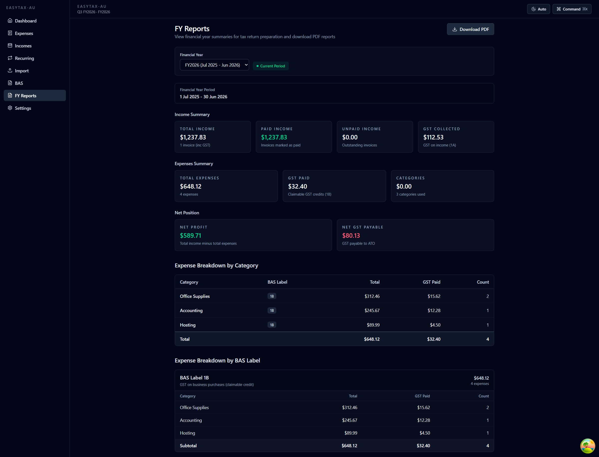
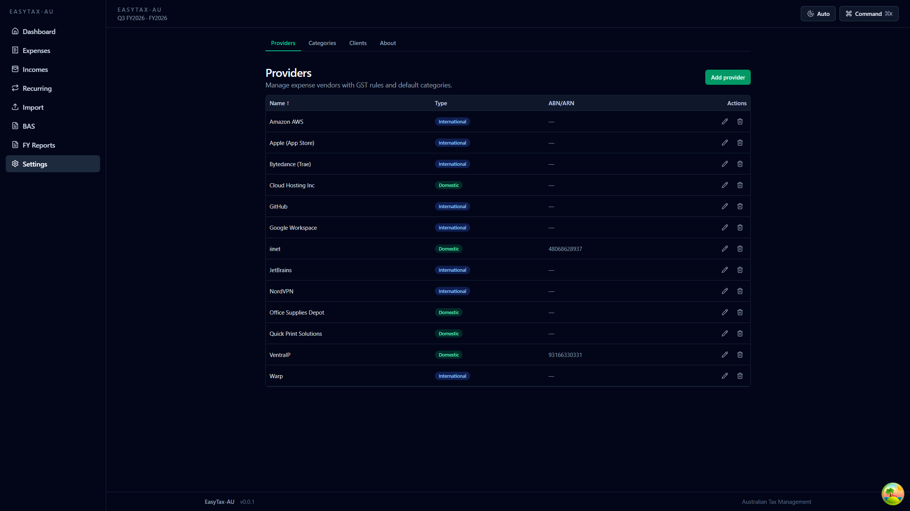

# EasyTax-AU 🇦🇺

A modular financial engine for Australian freelancers. Automates Simpler BAS, GST reconciliation, and deduction tracking.

## Technical Goals

- **Self-Hosted:** Optimized for Proxmox LXC / Docker.
- **Privacy First:** Local-only data processing with database-level encryption.
- **Dev-Centric:** Metadata-driven provider system (Google, ChatGPT, VentraIP).
- **Frontend SPA:** React 19 + Vite 7 + Tailwind CSS 4 with shadcn-style components, using a fetch-based API client and TanStack Query for data fetching.
- **CSV Import:** Bulk import expenses/incomes with preview, validation, and duplicate detection.

---

## Quick Start

### Prerequisites

- [fnm](https://github.com/Schniz/fnm) (Fast Node Manager)
- [pnpm](https://pnpm.io/) 9.x
- [Docker](https://www.docker.com/) & Docker Compose

### Installation

```bash
# 1. Clone the repository
git clone https://github.com/YOUR_USERNAME/easytax-au.git
cd easytax-au

# 2. Set up Node.js (via fnm)
fnm install 20
fnm use 20

# 3. Install dependencies
pnpm install

# 4. Copy environment variables
cp .env.example .env

# 5. Start the database
docker compose up -d easytax-au-db

# 6. Run the application
pnpm run start:dev
```

### Frontend Development (React SPA)

The frontend is a React 19 SPA located in `web/` that communicates with the NestJS API.

#### Quick Start

```bash
# 1. Install dependencies (from project root)
pnpm install

# 2. Set up frontend environment variables
cp web/.env.example web/.env
# Edit web/.env if needed (defaults work for local development)

# 3. Start the dev server
pnpm --filter web dev    # http://localhost:5173
```

#### Frontend Scripts

| Command | Description |
|---------|-------------|
| `pnpm --filter web dev` | Start Vite dev server with HMR (port 5173) |
| `pnpm --filter web build` | Build for production (outputs to `web/dist`) |
| `pnpm --filter web preview` | Preview production build locally |
| `pnpm --filter web lint` | Run ESLint on frontend code |
| `pnpm --filter web test` | Run Vitest unit tests in watch mode |
| `pnpm --filter web test:e2e` | Run Playwright E2E tests (headless) |
| `pnpm --filter web test:e2e:ui` | Run Playwright E2E tests with UI |

#### Troubleshooting

**Issue: "Failed to fetch" or CORS errors**
- Ensure the backend API is running on `http://localhost:3000`
- Check `web/.env` has correct `VITE_API_URL` (default: `http://localhost:3000`)
- Verify backend CORS is configured (should allow `http://localhost:5173` in development)

**Issue: "Cannot find module '@shared/types'"**
- Run `pnpm run generate:types` to generate OpenAPI types from the backend
- Ensure backend API is running (types are generated from `/api/docs-json`)

**Issue: Frontend builds but shows blank screen**
- Check browser console for errors
- Verify `VITE_API_URL` is set correctly for your environment
- For production builds, ensure API is accessible from the frontend's host

### Available Scripts

|| Command | Description |
|| -------------------------- | ------------------------------------------------ |
|| `pnpm run start:dev` | Start API in development mode (watch) |
|| `pnpm run build` | Build API for production |
|| `pnpm run start:prod` | Start production API build |
|| `pnpm run test` | Run backend unit tests |
|| `pnpm run test:cov` | Run backend tests with coverage report |
|| `pnpm run test:e2e` | Run backend end-to-end tests |
|| `pnpm run lint` | Run backend ESLint |
|| `pnpm run format` | Run Prettier on backend source |
|| `pnpm run generate:types` | Generate shared API types to `shared/types/api.d.ts` |

### Docker Deployment (Full Stack)

For production deployment, all services (database, API, and frontend) run in containers.

#### Standard Deployment (HTTP)

```bash
# 1. Copy and configure environment variables
cp .env.example .env
# Edit .env and set: DB_PASSWORD, ENCRYPTION_KEY

# 2. Build and start all services (database, API, frontend)
docker compose up -d --build

# 3. View logs
docker compose logs -f easytax-au-web    # Frontend logs
docker compose logs -f easytax-au-api    # API logs

# 4. Stop all services
docker compose down
```

**Endpoints:**
- **Frontend:** `http://localhost` (port 80)
- **API:** `http://localhost:3000`
- **Swagger Docs:** `http://localhost:3000/api/docs`

#### Traefik Deployment (HTTPS)

For production with HTTPS via Traefik reverse proxy:

```bash
# 1. Configure .env for Traefik
cp .env.example .env
# Edit .env and set:
TRAEFIK_ENABLED=true
TRAEFIK_HOST=easytax.bobeliadesign.com
DB_PASSWORD=your_secure_password
ENCRYPTION_KEY=$(openssl rand -hex 32)

# 2. Start services
docker compose up -d --build

# 3. Configure Traefik (if not already set up)
# Ensure Traefik is on the same Docker network: easytax-au-network
# Or add Traefik labels to connect to your existing Traefik network
```

**Traefik Configuration Notes:**
- Frontend container has pre-configured Traefik labels
- HTTPS redirect is automatic when `TRAEFIK_ENABLED=true`
- Domain: `easytax.bobeliadesign.com`
- TLS certificates managed by Traefik (Let's Encrypt recommended)
- Access via: `https://easytax.bobeliadesign.com`

#### Environment Variables

**Backend Variables (root `.env`):**

| Variable           | Required | Default       | Description                                    |
| ------------------ | -------- | ------------- | ---------------------------------------------- |
| `DB_PASSWORD`      | ✅       | -             | PostgreSQL password                            |
| `ENCRYPTION_KEY`   | ✅       | -             | 64-char hex key (generate: `openssl rand -hex 32`) |
| `DB_HOST`          | ❌       | localhost     | Database host (auto-set to `easytax-au-db` in Docker) |
| `DB_PORT`          | ❌       | 5432          | PostgreSQL port                                |
| `DB_NAME`          | ❌       | easytax-au    | Database name                                  |
| `DB_USERNAME`      | ❌       | postgres      | Database user                                  |
| `PORT`             | ❌       | 3000          | API server port                                |
| `NODE_ENV`         | ❌       | development   | Environment mode (development/production)      |

**Frontend Variables (`web/.env`):**

| Variable           | Required | Default       | Description                                    |
| ------------------ | -------- | ------------- | ---------------------------------------------- |
| `VITE_API_URL`     | ❌       | `http://localhost:3000` | Backend API base URL (use `/api` for production Docker) |

**Docker-Only Variables (root `.env`):**

| Variable           | Required | Default       | Description                                    |
| ------------------ | -------- | ------------- | ---------------------------------------------- |
| `WEB_PORT`         | ❌       | 80            | Frontend nginx port (Docker only)              |
| `TRAEFIK_ENABLED`  | ❌       | false         | Enable Traefik reverse proxy integration       |
| `TRAEFIK_HOST`     | ❌       | easytax.bobeliadesign.com | Domain for Traefik routing (when enabled) |

**Security Notes:**
- Never commit `.env` files to version control
- Use `.env.example` as a template
- Store `ENCRYPTION_KEY` securely (rotating it requires re-encrypting all client names/ABNs)
- Generate strong `DB_PASSWORD` using a password manager

#### Production Checklist

- [ ] Set strong `DB_PASSWORD` (use password manager)
- [ ] Generate unique `ENCRYPTION_KEY` (use `openssl rand -hex 32`)
- [ ] Configure automatic backups for `./pgdata` directory
- [ ] Set up Traefik with Let's Encrypt for HTTPS
- [ ] Review firewall rules (only expose port 80/443 via Traefik)
- [ ] Test backup restoration process

---

## Features

### Dashboard
- **Current BAS Period Summary**: G1 (Total Sales), 1A (GST Collected), 1B (GST Paid), Net GST Payable/Refund
- **Recent Expenses**: Latest 10 expense entries sorted by date
- **Upcoming Recurring Expenses**: Due recurring templates with color-coded status
- **Quick Actions**: Fast access to add expenses and incomes



### Expense Management
- **Full CRUD Operations**: Create, read, update, and delete expenses
- **Smart GST Calculation**: Automatic 1/11 calculation for domestic providers, $0 for international
- **Business Use Slider**: Visual percentage slider (0-100%) with real-time claimable GST calculation
- **Filtering & Sorting**: Filter by provider, category, date range; sort by date, amount, provider
- **CSV Import**: Bulk import with preview, validation, and duplicate detection



### Income Tracking
- **Invoice Management**: Track income with invoice numbers, subtotal, GST (auto-calculated at 10%), and totals
- **Quick Paid Toggle**: One-click status updates from unpaid to paid
- **Client Management**: Encrypted client storage with ABN validation and PSI eligibility tracking
- **Filtering**: Filter by client, paid/unpaid status, and date range



### BAS Reporting
- **Quarterly Summaries**: View BAS for any quarter with automatic period calculation
- **PDF Export**: Download BAS reports with all required ATO fields (G1, 1A, 1B)
- **Record Counts**: See how many income and expense records contribute to each BAS period



### Financial Year Reports
- **Annual Summaries**: Complete FY breakdown for tax return preparation
- **Income Analysis**: Total income, paid/unpaid split, GST collected
- **Expense Analysis**: Breakdown by category and BAS label (1B, G10, G11)
- **Net Position**: Profit/Loss calculation and Net GST Payable/Refund
- **PDF Export**: Downloadable FY reports with all details



### Recurring Expenses
- **Automated Templates**: Set up monthly, quarterly, or yearly recurring expenses
- **Smart Scheduling**: Configure day-of-month (1-28) to avoid month-end issues
- **Due Date Tracking**: Color-coded status (overdue/due soon/future)
- **Bulk Generation**: Generate all due expenses with confirmation dialog
- **Pause/Resume**: Temporarily suspend templates without deletion


### Settings & Configuration
- **Providers**: Manage expense vendors with international flag and default categories
- **Categories**: Organize expenses with BAS label mapping (1B/G10/G11)
- **Clients**: Encrypted client storage with ABN and PSI tracking
- **Related Records**: See counts of expenses/incomes linked to each provider/category/client



### Dark Mode
- **Theme Toggle**: Cycle between Light, Dark, and Auto (system preference)
- **Persistent Settings**: Theme choice saved to localStorage
- **Accessible**: Keyboard navigable with proper ARIA labels


---

## Keyboard Shortcuts

EasyTax-AU is fully keyboard accessible. All features can be used without a mouse.

### Global Shortcuts

| Shortcut | Action | Context |
|----------|--------|---------|
| `⌘K` / `Ctrl+K` | Open command palette | Anywhere in the app |
| `Escape` | Close modal/dialog | When a modal is open |
| `Tab` | Navigate to next element | Form fields, buttons, links |
| `Shift+Tab` | Navigate to previous element | Form fields, buttons, links |
| `Enter` | Submit form or activate button | Forms, buttons |
| `Space` | Toggle checkbox/switch | Checkboxes, toggles |

### Navigation

| Action | Method |
|--------|--------|
| Navigate between sections | Click sidebar links or use `Tab` to reach navigation |
| Open/close mobile menu | Click hamburger icon (on mobile) or use `Tab` + `Enter` |
| Skip to main content | Press `Tab` on page load to reveal skip link, then `Enter` |

### Data Tables

| Action | Method |
|--------|--------|
| Sort column | Click column header or use `Tab` + `Enter` |
| Open row actions | `Tab` to Edit/Delete buttons, then `Enter` |
| Navigate table | Use `Tab` to move between interactive elements |

### Forms

| Action | Method |
|--------|--------|
| Navigate fields | `Tab` / `Shift+Tab` |
| Submit form | `Tab` to submit button, then `Enter` |
| Cancel/close | `Escape` key or `Tab` to Cancel button |
| Date picker | Type date in `YYYY-MM-DD` format or use native date picker |
| Dropdown select | `Tab` to select, `Arrow Up/Down` to choose, `Enter` to confirm |

### Theme Toggle

| Action | Shortcut |
|--------|----------|
| Change theme | Click theme button in header to cycle: Light → Dark → Auto → Light |

### Accessibility Features

- **Focus Indicators**: All interactive elements show a visible sky-blue outline on keyboard focus
- **Screen Reader Support**: Proper ARIA labels, semantic HTML, and live regions for dynamic content
- **Skip Links**: Press `Tab` on any page to reveal "Skip to main content" link
- **Form Validation**: Error messages displayed inline with accessible labels
- **Loading States**: Screen readers announce loading and completion states

---

## Documentation

Documentation is organized into three tiers for AI efficiency and human clarity.

### ⭐ Active Development
| Document | Purpose |
|----------|---------|
| [NEXT-FRONTEND.md](NEXT-FRONTEND.md) | Final 6% of frontend work (6 tasks remaining) |
| [CLAUDE.md](CLAUDE.md) | AI agent directives and workflow |
| [AGENTS.md](AGENTS.md) | AI coding guidelines and best practices |

### 🏗 Core Documentation (Technical Reference)
| Document | Purpose |
|----------|---------|
| [docs/core/ATO-LOGIC.md](docs/core/ATO-LOGIC.md) | **CRITICAL** - Australian tax rules, GST calculations, BAS labels |
| [docs/core/ARCHITECTURE.md](docs/core/ARCHITECTURE.md) | Tech stack, module design, frontend/backend structure |
| [docs/core/SCHEMA.md](docs/core/SCHEMA.md) | Database entities, relationships, and encryption |
| [docs/core/SECURITY.md](docs/core/SECURITY.md) | AES-256-GCM encryption, key management, data sovereignty |
| [docs/core/BACKUP.md](docs/core/BACKUP.md) | 3-2-1 backup strategy and recovery procedures |

### 📦 Archive (Historical - Completed Work)
| Document | Purpose |
|----------|---------|
| [docs/archive/TASKS-DONE.md](docs/archive/TASKS-DONE.md) | Backend development checklist (95% complete) |
| [docs/archive/TASKS-FRONTEND.md](docs/archive/TASKS-FRONTEND.md) | Frontend development checklist (94% complete) |
| [docs/archive/ROADMAP-DONE.md](docs/archive/ROADMAP-DONE.md) | Historical MVP scope and development phases |
| [docs/archive/BACKLOG.md](docs/archive/BACKLOG.md) | Old feature ideas and brainstorming |
| [docs/archive/FUTURE-ENHANCEMENTS.md](docs/archive/FUTURE-ENHANCEMENTS.md) | Deferred features (inline editing, screen reader testing) |
| [docs/archive/CHANGELOG-*.md](docs/archive/) | Historical change logs |

**Note:** The tiered structure reduces AI context bloat by ~80%, focusing agents on active work in `NEXT-FRONTEND.md` and critical tax logic in `docs/core/ATO-LOGIC.md`.
